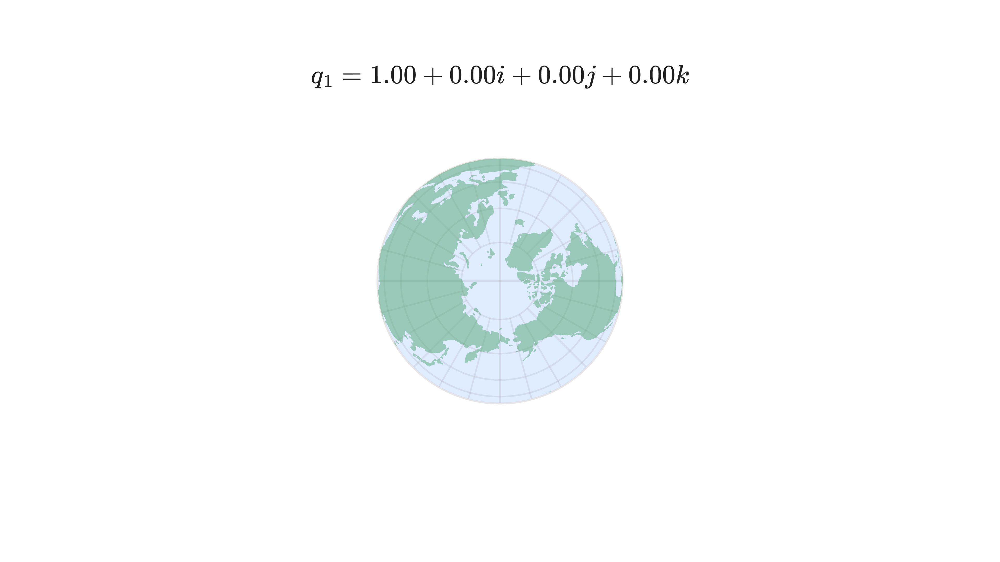
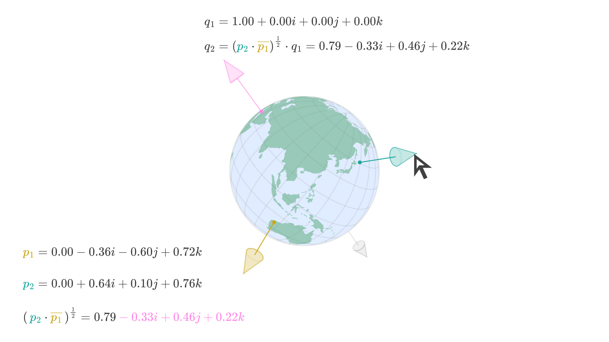
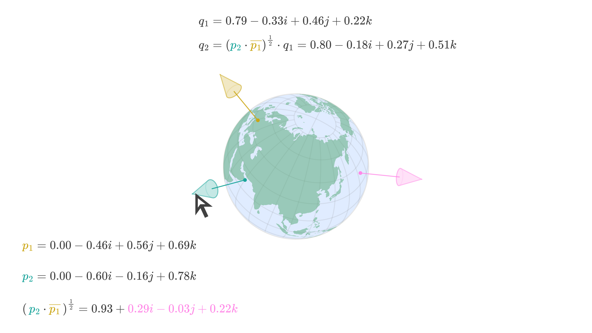
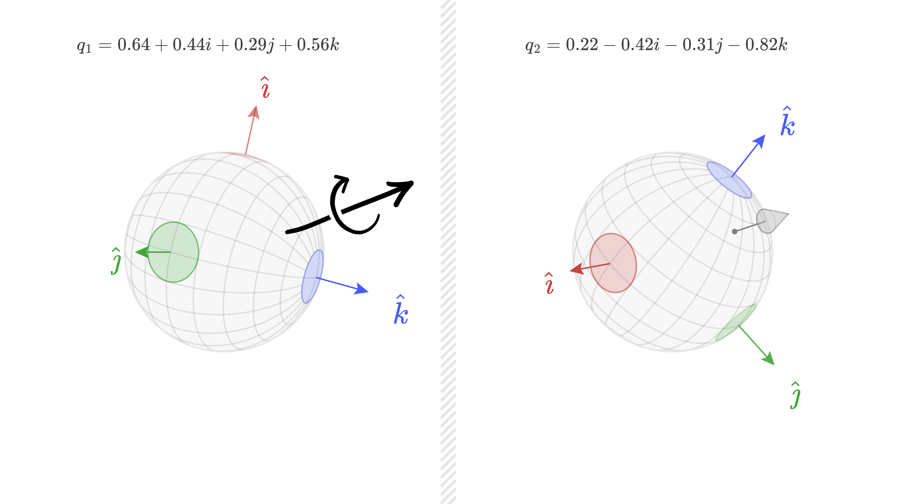
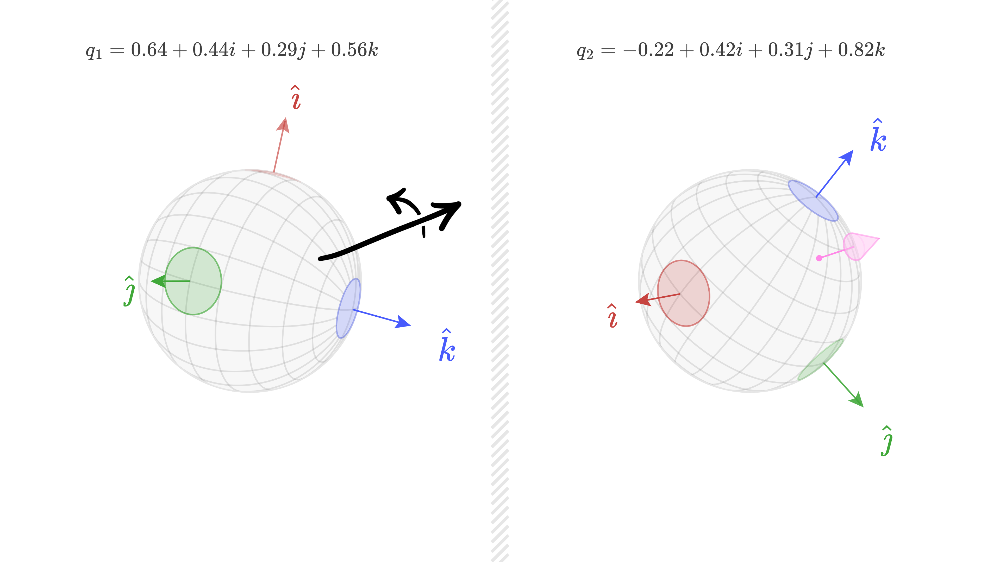

# Quaternion

A Python class for demonstrating the use of quaternions for 3D rotations. See the implementation in the `src/quaternion.py` file and the demos which are discussed below.

To see how this class is implemented see [this video](https://youtu.be/hgmLSnVuvcY).

## Installation

Create a virtual environment:

```bash
python -m venv .venv
```

Activate the virtual environment:

```bash
source .venv/bin/activate
```

Install the dependencies:

```bash
pip install -r requirements.txt
```

## Testing

Run the test suite to verify the implementation:

```bash
pytest -v
```

## Basic Demo

This is the `ipython` demo from the [video](https://youtu.be/hgmLSnVuvcY) which I used to introduce this quaternion class.

```python
from src.vector3 import Vector3
from src.quaternion import Quaternion

# Quaternion representing the orientation of the Earth
q = Quaternion(0.83, 0.34, -0.44, 0.02)

# Create the basis vectors
i_hat = Vector3(1, 0, 0)
j_hat = Vector3(0, 1, 0)
k_hat = Vector3(0, 0, 1)

# Transform the basis vectors using the quaternion
print(q.transform(i_hat))
print(q.transform(j_hat))
print(q.transform(k_hat))

import math

# Construct a rotation quaternion from an axis and angle
r = Quaternion.from_axis_angle(Vector3(0, 1, 0), math.pi/2)

# Apply the rotation
q = r.multiply(q)

# Print the resulting quaternion
print(q)

# %recall 7 8 9
print(q.transform(i_hat))
print(q.transform(j_hat))
print(q.transform(k_hat))
```

## Rotation Demo

The `demo_rotate.py` script demonstrates interactive 3D rotation using quaternions. It simulates mouse drag operations on a virtual trackball to rotate a 3D Earth model. To run the demo, run the following command:

```bash
python demo_rotate.py
```

You should see the following output:

```
=== Simple Mouse Drag Rotation Demo ===

--- First Drag Event ---

Starting orientation: 1.00 + 0.00i + 0.00j + 0.00k
Mouse start: (384, 432)
Mouse end: (653, 243)
Sphere point 1: [-0.356, -0.600, 0.717]
Sphere point 2: [0.641, 0.100, 0.761]
Calculated rotation: 0.79 - 0.33i + 0.46j + 0.22k
Rotation description: Rotation by 75.1° around axis [-0.547, 0.755, 0.361]
New orientation: 0.79 - 0.33i + 0.46j + 0.22k

--- Second Drag Event ---

Starting orientation: 0.79 - 0.33i + 0.46j + 0.22k
Mouse start: (355, 119)
Mouse end: (317, 313)
Sphere point 1: [-0.463, 0.559, 0.688]
Sphere point 2: [-0.604, -0.159, 0.781]
Calculated rotation: 0.93 + 0.29i - 0.03j + 0.22k
Rotation description: Rotation by 43.3° around axis [0.796, -0.079, 0.599]
Final orientation: 0.80 - 0.18i + 0.27j + 0.51k
```

The visual representation of the rotations is shown below where the Earth is initially oriented with the North Pole up.

<picture>
  <source media="(prefers-color-scheme: dark)" srcset="./images/EarthInitialPosition-dark-theme.png">
  <source media="(prefers-color-scheme: light)" srcset="./images/EarthInitialPosition-light-theme.png">
  
</picture>

After the first drag operation, the Earth is rotated to this orientation.

<picture>
  <source media="(prefers-color-scheme: dark)" srcset="./images/RotateEarthFirstDrag-dark-theme.png">
  <source media="(prefers-color-scheme: light)" srcset="./images/RotateEarthFirstDrag-light-theme.png">
  
</picture>

After the second drag operation, the Earth is rotated to this orientation.

<picture>
  <source media="(prefers-color-scheme: dark)" srcset="./images/RotateEarthSecondDrag-dark-theme.png">
  <source media="(prefers-color-scheme: light)" srcset="./images/RotateEarthSecondDrag-light-theme.png">
  
</picture>

In practice, you should calculate and apply the rotation each time the mouse moves during a drag operation. I chose to show one big rotation for demonstration purposes, but the downside of this approach is that the Earth moves in an unexpected manner during an extend drag operation (for example, dragging in a big U shape).

The benefit of applying small rotations each time the mouse moves during a drag operation is that the Earth moves in a consistent manner at the beginning and end of the drag operation. Because Quaternions are numerically stable, you don't need to worry about accumulating errors and the orientation drifting over time.

## SLERP Demo

The `demo_slerp.py` script demonstrates Spherical Linear Interpolation (SLERP) between two orientations using quaternions. This shows how to smoothly animate between any two orientations of the Earth. To run the demo, run the following command:

```bash
python demo_slerp.py
```

You should see the following output:

```
=== SLERP Demo ===


--- SLERP Long Path ---


Interpolating between q_1 and q_2

q_1=0.64 + 0.44i + 0.29j + 0.56k
q_2=0.22 - 0.42i - 0.31j - 0.82k
Ensure shortest path: False
Total rotation: 252.2° around axis [-0.538, -0.177, -0.824]

t=0.00: q=0.64 + 0.44i + 0.29j + 0.56k
t=0.10: q=0.79 + 0.38i + 0.25j + 0.41k
t=0.20: q=0.90 + 0.31i + 0.19j + 0.24k
t=0.30: q=0.97 + 0.22i + 0.12j + 0.07k
t=0.40: q=0.98 + 0.12i + 0.05j - 0.12k
t=0.50: q=0.96 + 0.02i - 0.02j - 0.29k
t=0.60: q=0.88 - 0.09i - 0.10j - 0.45k
t=0.70: q=0.76 - 0.19i - 0.17j - 0.59k
t=0.80: q=0.61 - 0.28i - 0.23j - 0.70k
t=0.90: q=0.43 - 0.36i - 0.28j - 0.78k
t=1.00: q=0.22 - 0.42i - 0.31j - 0.82k


--- SLERP Shortest Path ---


Interpolating between q_1 and q_2

q_1=0.64 + 0.44i + 0.29j + 0.56k
q_2=0.22 - 0.42i - 0.31j - 0.82k
Ensure shortest path: True
Dot product: -0.589
Dot product is negative, so negated q2 is closer: -0.22 + 0.42i + 0.31j + 0.82k
Changing target quaternion q_2 to -0.22 + 0.42i + 0.31j + 0.82k
Total rotation: 107.8° around axis [0.538, 0.177, 0.824]

t=0.00: q=0.64 + 0.44i + 0.29j + 0.56k
t=0.10: q=0.57 + 0.46i + 0.31j + 0.61k
t=0.20: q=0.49 + 0.47i + 0.32j + 0.66k
t=0.30: q=0.41 + 0.48i + 0.33j + 0.70k
t=0.40: q=0.32 + 0.48i + 0.34j + 0.74k
t=0.50: q=0.24 + 0.48i + 0.34j + 0.77k
t=0.60: q=0.15 + 0.48i + 0.34j + 0.80k
t=0.70: q=0.05 + 0.47i + 0.34j + 0.81k
t=0.80: q=-0.04 + 0.46i + 0.33j + 0.82k
t=0.90: q=-0.13 + 0.44i + 0.32j + 0.82k
t=1.00: q=-0.22 + 0.42i + 0.31j + 0.82k
```

The key insight of this demo is that quaternions have "double coverage" - both `q` and `-q` represent the same orientation in 3D space. When interpolating between two orientations, SLERP ensures the shortest path by checking the dot product between the quaternions. If the dot product is negative, it negates the target quaternion to ensure the rotation takes the shortest path.

The visual representation of the animations is shown below. When not ensuring the shortest path, the Earth rotates along the longer arc between the orientations.

<picture>
  <source media="(prefers-color-scheme: dark)" srcset="./images/AnimateLongPath-dark-theme.png">
  <source media="(prefers-color-scheme: light)" srcset="./images/AnimateLongPath-light-theme.png">
  
</picture>

When ensuring the shortest path, the Earth rotates along the shorter arc between the orientations.

<picture>
  <source media="(prefers-color-scheme: dark)" srcset="./images/AnimateShortPath-dark-theme.png">
  <source media="(prefers-color-scheme: light)" srcset="./images/AnimateShortPath-light-theme.png">
  
</picture>

You can also see the code used to generate the animations in the video in this repository. However, it's a bit messy and not well documented.